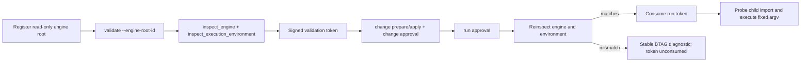

# 迭代 001：可信执行与发行契约设计文档

## 1. 设计摘要

本设计把“调用方声明的哈希”替换为“产品重新计算的描述符”。引擎描述符来自一个只读 registered root；环境描述符来自正在执行 agent 的解释器。两个内容哈希在 validation 时写入签名 token，run 在 token 消费前重新计算并比较。这样保留现有审批模型，同时消除原始 CLI 字符串成为受控执行授权依据的路径。



## 2. 引擎与环境描述符

### 2.1 `inspect_engine(roots, root_id)`

保留函数位置 `src/backtrader_agent/engines.py`，将其输出扩展为：

```python
{
    "schema_version": "engine-runtime-v2",
    "root_id": "engine",
    "package": "backtrader",
    "version": "1.9.78.123",
    "initializer_sha256": "<64 hex>",
    "version_file_sha256": "<64 hex>",
    "package_tree_sha256": "<64 hex>",
    "package_file_count": 123,
    "engine_hash": "<hash_object of every preceding field>",
}
```

`package_tree_sha256` 的输入是按相对 POSIX 路径排序的对象 `{relative_path: sha256}`。实现只枚举 `root/backtrader` 内的普通文件，忽略所有 `__pycache__` 目录和 `.pyc`；目录或文件符号链接、设备、FIFO、解析后越出包目录的路径必须失败。这个设计不把安装过程误认为不可变，只确保 validation 与 run 看到相同的实际引擎内容。

### 2.2 `inspect_execution_environment()`

在同一模块新增纯标准库函数：

```python
{
    "schema_version": "execution-environment-v1",
    "python_executable": "/absolute/path/to/python",
    "python_version": "3.12.x",
    "python_implementation": "CPython",
    "platform": "...",
    "environment_hash": "<hash_object of preceding fields>",
}
```

该描述符不包含候选策略、数据或机密；它仅用于让签名 token 绑定真实执行器。`doctor` 可展示结构化环境字段，但 run manifest 继续只保存哈希与不泄漏绝对外部路径的必要证明。

## 3. CLI、token 与 runner 变化

### 3.1 CLI

`build_parser()` 的 `validate` 子命令改为：

```python
validate.add_argument("--engine-root-id", required=True)
```

删除 `--engine-hash` 和 `--environment-hash`。在 `dispatch()` 中，CLI 必须执行：

```python
engine = inspect_engine(roots, args.engine_root_id)
environment = inspect_execution_environment()
bindings = {
    "dataset_hash": args.dataset_hash,
    "engine_hash": engine["engine_hash"],
    "engine_root_id": engine["root_id"],
    "environment_hash": environment["environment_hash"],
}
```

dataset binding 的既有产品记录检查保持不变；本轮不扩大其语义。

### 3.2 Token authority

`REQUIRED_BINDINGS["validation"]` 新增 `engine_root_id`。验证 token 的签名、消费和 change/run approval 重新认证逻辑保持原样；只有由已注册 root 派生的 token 才能到达 run。

### 3.3 ControlledRunner

在 `run()` 内、`authority.consume(run_token, ...)` 前执行下列两个验证：

1. 调用 `_resolve_engine(validation_token)`，重新计算 `inspect_engine()` 并比较 `engine_hash`；root 缺失、root writable、包树改动或 child probe 失败均返回稳定 `BTAG-ENGINE-*` 诊断。
2. 调用 `_verify_execution_environment(validation_token)`，重新计算 `inspect_execution_environment()` 并比较 `environment_hash`；不一致返回 `BTAG-ENVIRONMENT-HASH`。

通过后才检查 profile 依赖、消费 token、转入 RUNNING 并启动固定 argv。失败路径不得创建 run result、不得运行 candidate、不得消费 run token。

### 3.4 Doctor

保持 `status` 为基础产品就绪信号，并新增：

```python
"execution_ready": bool,
"execution_profiles": {
    "python_bundle": {"ready": bool, "missing": ["..."]},
    "single_test": {"ready": bool, "missing": ["..."]},
},
```

`execution_ready` 仅在至少一个有效 read-only engine root 和 `python_bundle` 依赖可用时为真。无 root 时 `doctor` 仍能诊断基础包，但必须给出可操作的注册 hint。

## 4. 依赖发行与预检

`pyproject.toml` 使用 PEP 621 optional dependencies：

```toml
[project.optional-dependencies]
backtest = ["backtrader>=1.9.78.123", "pandas>=1.0"]
single-test = ["pytest>=7"]
test = [
  "backtrader>=1.9.78.123",
  "pandas>=1.0",
  "pytest>=7",
  "jsonschema>=4",
  "build>=1",
  "setuptools>=68",
  "wheel>=0.41",
]
```

新建小型运行时依赖检查函数，以 `importlib.util.find_spec` 确认模块存在而不导入候选策略。`python_bundle` 缺 `backtrader` 或 `pandas` 时、`single_test` 额外缺 `pytest` 时，runner 在 token 消费前产生 `BTAG-RUN-DEPENDENCY`，details 仅列模块名和 profile。

基础包不安装这些 extras 仍可使用 `doctor`、`payload`、roots、会话、data inspect、静态校验；README 分别展示基础安装与 `pip install 'backtrader-agent[backtest]'`。

## 5. CI 与 consumer 验证

CI 分成两个职责明确的 job：

| Job | Python | 安装 | 门 |
| --- | --- | --- | --- |
| `test` | 3.8、3.9、3.11、3.12 | `python -m pip install '.[test]'` | pytest、independence、doctor、manifest freshness |
| `acceptance` | 3.12 | `python -m pip install '.[test]'` | `scripts/run_acceptance.py` 的 14-cell matrix、crash-resume、repair、clean-wheel isolation |

wheel 测试读取 wheel 内 `.dist-info/METADATA`，验证 `Provides-Extra` 和 `Requires-Dist`，而不是依赖当前开发环境恰好装有的包。CI 不接受手工 `pip install backtrader pandas ...` 作为项目依赖真相。

## 6. 文档、manifest 与许可证一致性

`examples/README.md` 在 data register 前增加 `session create`；README 中英文和 CONTRIBUTING 使用新的 extras、root-bound workflow 和 doctor readiness 解释。所有本轮文件进入根 manifest；包内源变更进入包 manifest，统一由 `scripts/build_manifest.py` 生成。

维护者已确认 MIT 是权威许可证：保留现有 `LICENSE` 文本，将 `pyproject.toml` 的 `license` 字段改为 MIT，并在 wheel metadata 测试中断言该值。版本号不因本项变更。
